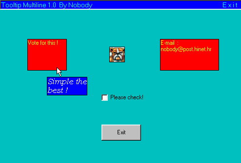



## Tooltip Multiline 1\.0

### Description

Tooltip text with multi line, more backcolor, font, fontsize etc...
 
### More Info
 

             |
---                |---
**Submitted On**   |2001-09-26 21:28:12
**By**             |[Surlina](https://github.com/Planet-Source-Code/PSCIndex/blob/master/ByAuthor/surlina.md)
**Level**          |Intermediate
**User Rating**    |4.6 (37 globes from 8 users)
**Compatibility**  |VB 4\.0 \(16\-bit\), VB 4\.0 \(32\-bit\), VB 5\.0, VB 6\.0
**Category**       |[Coding Standards](https://github.com/Planet-Source-Code/PSCIndex/blob/master/ByCategory/coding-standards__1-43.md)
**World**          |[Visual Basic](https://github.com/Planet-Source-Code/PSCIndex/blob/master/ByWorld/visual-basic.md)
**Archive File**   |[tooltip 1\_2701492620\.zip](https://github.com/Planet-Source-Code/surlina-tooltip-multiline-1-0__1-27570/archive/master.zip)

